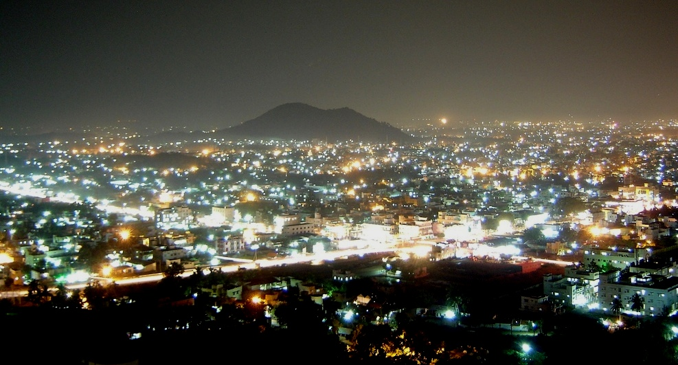

# 🏔️ Visit Salem — Tamil Nadu Travel Guide

A simple, responsive travel guide website built with HTML and CSS, showcasing the best places to visit in Salem, Tamil Nadu.

---

## 📌 About the Project

This is a static front-end project built as part of my web development learning journey. It highlights three must-visit destinations around Salem — Yercaud, Killiyur Waterfalls, and Mettur Dam — along with a local guide section.

---

## 🌐 Live Demo

link

---

## 🖼️ Screenshots

| Hero Section | Activities Section |
|---|---|
|  | *(screenshot)* |

---

## 🛠️ Built With

- HTML5
- CSS3
- Google Fonts — Playfair Display & Lato
- Flexbox for layout

---

## 📁 Project Structure
```
visit-salem/
├── index.html
├── style.css
└── images/
    ├── salem-background.jpg
    ├── yercard.jpg
    ├── killiyur_falls.jpg
    ├── mettur_dam.webp
    └── guide-pic.png
```

---

## ✨ Features

- Responsive hero section with background image
- Three-column activity cards with circular images
- Local guide section with bio
- Custom color palette and Google Fonts
- Clean, minimal travel-page design

---

## 🚀 Getting Started

1. Clone the repository
```bash
   git clone https://github.com/yourusername/visit-salem.git
```
2. Open `index.html` in your browser — no build tools needed.

---

## 🙋‍♂️ Author

**Arjun Selvam**  
Built with curiosity and a love for Salem. 🌿

---

## 📄 License

This project is open source and available under the [MIT License](LICENSE).
